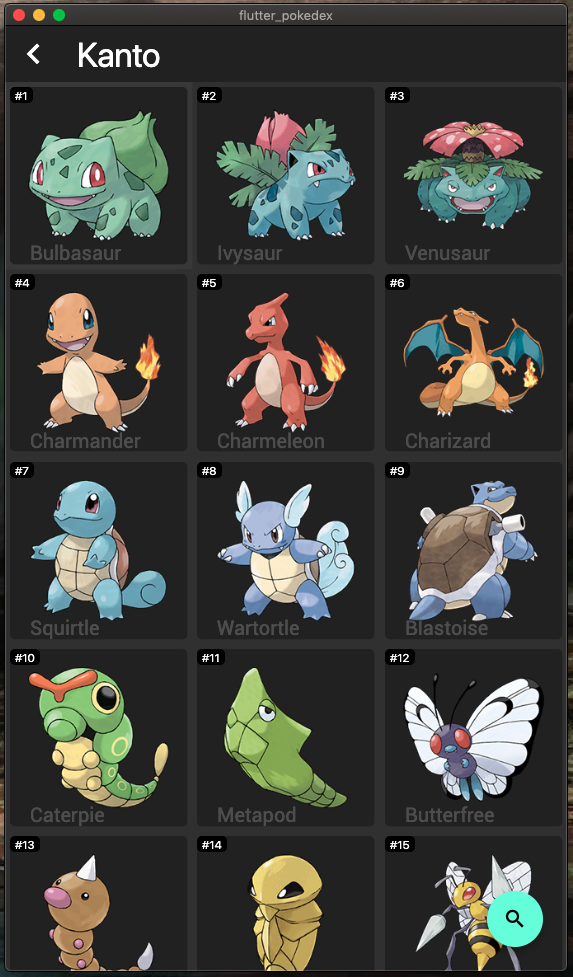
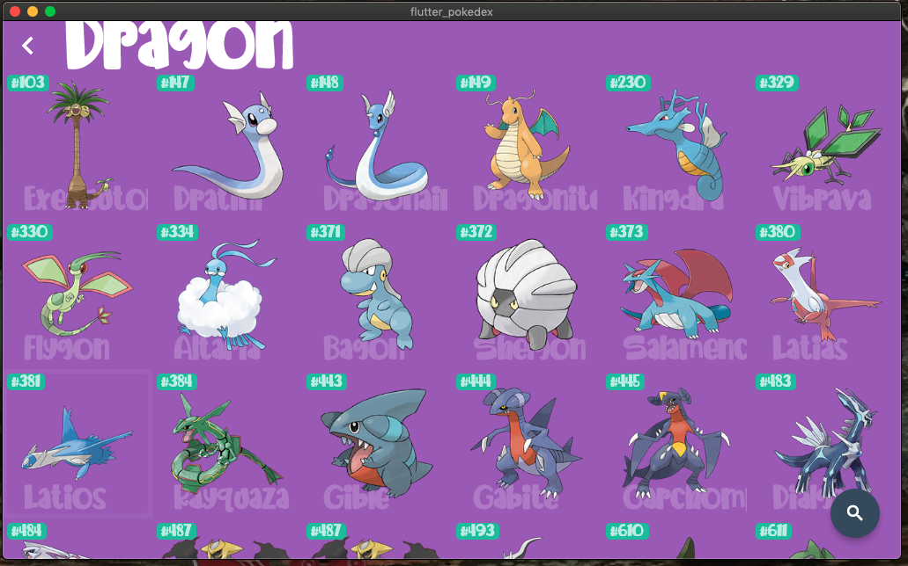

# Flutter pokedex

**Descarga la 
[app](https://raw.githubusercontent.com/jalector/flutter_pokedex/master/repo/pokedex.apk)**
## Inspiración para la aplicación
Flutter pokedex es una aplicación de practica. Esta basada en la idea de una pokedex que aparece en la serie de anime Pokémon. Pokemón es una serie de anime de la decada de los 90 en la que aparecen diferentes criaturas que tienen diferentes habilidades, tamaños y tipos. De la cual la enciclopedia en la que se describen la naturaleza, altura, tipo, y peso se le llama pokedex. 

## Contenido
La aplicación puede mostrar siete de las ocho generaciones de pokemón, en las cuales se pueden realizar varias acciones: 

- Ver los pokémon por generación (Kanto, Johto, Hoenn...)
- Ver los pokémon por tipo
- Filtrar dentro de la pantalla de pokedex los pokemons por nombre o tipo

Dentro de la aplicación se puede cambiar el tema de toda la aplicación dentro del menu lateral hasta la parte de abajo. 

## Estrategias para desarrollar la aplicación

En flutter pokedex he tradado de hacerlo lo más limpio posible, usando pattern, para el cambio del uso del tema, para mantener los pokémon que deben ser mostrado se usa un solo stream en toda la app, haciendo uso de bloc pattern. 

Me he apoyado en los widget que es han publicado en Youtube por Flutter que tienen cómo titulo **Flutter Widget on the Week**, además de otras listas de reproducción como **Flutter in focus** que tienen en su canal de [Youtube](https://www.youtube.com/flutterdev).  

La aplicación hace uso de [OrientationBuilder](https://api.flutter.dev/flutter/widgets/OrientationBuilder-class.html), que ayuda a distribuir la información de manera diferente según lo que se necesite.

Hago uso de bibliotecas para varias cosas, como los son para el video: 
- [http](https://pub.dev/packages/http)
- [video_player](https://pub.dev/packages/video_player)
- [flutter_launcher_icons](https://pub.dev/packages/flutter_launcher_icons)
- [rxdart](https://pub.dev/packages/rxdart)
- [provider](https://pub.dev/packages/provider)
- [shared_preferences](https://pub.dev/packages/shared_preferences)

## Screenshots
### Home page

### Horizontal view

### Theme changed

### Seach page

## Resouces
- [Pokemon Go Hub](https://pokemongohub.net/)
- [Pokemon Fusion](https://pokemon.alexonsager.net/)
- [Flutter](https://flutter.dev/)